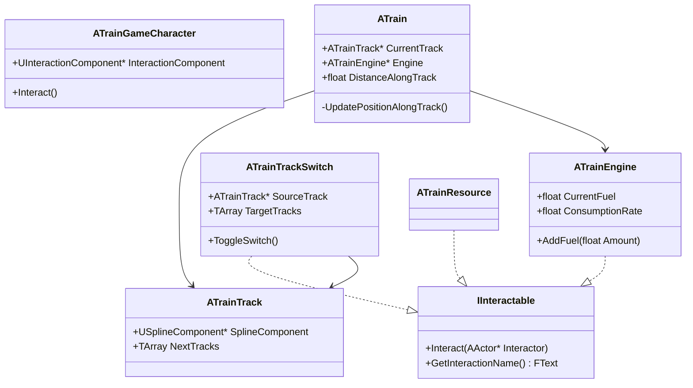

# Technical Specification & Implementation Plan: Train Game

## Overview
This document outlines the architecture for a top-down, local cooperative game where players stoke a train's engine with resources while navigating tracks with switchable paths.

---

## 1. Core Systems

### A. Interaction System (Plugin-Based)
Uses the `Interaction` plugin for standardized actor interaction.
- **`IInteractable` Interface**: Standard interface for all interactable objects.
- **`UInteractionComponent`**: Attached to `ATrainGameCharacter`. Manages detection and interaction logic.
- **Input**: "Interact" action bound in `ATrainGamePlayerController`.

### B. Resource System
- **`UTrainResourceData` (Primary Data Asset)**: 
    - Defines fuel values, name, and static meshes for resource types.
    - Allows designers to quickly add new resource types (Coal, Wood, etc.).
- **`ATrainResource` (Actor)**: 
    - Implements `IInteractable`.
    - Spawns in the world using `UTrainResourceData`.
    - Handles logic for being picked up by players.

### C. Engine & Fuel Mechanics
- **`ATrainEngine` (Actor)**:
    - Implements `IInteractable`.
    - Stores `CurrentFuel` (0.0 to `MaxFuel`).
    - Consumes fuel over time (`ConsumptionRate`).
    - Provides a `FuelRatio` (0.0 - 1.0) to control train speed.

### D. Train Movement & Tracks
- **`ATrainTrack` (Actor)**:
    - Contains a `USplineComponent` for the path.
    - Stores an array of `NextTracks` for path branching.
- **`ATrain` (Actor)**:
    - Follows the spline of the `CurrentTrack`.
    - Calculates speed based on `ATrainEngine`'s fuel ratio.
    - Handles track transitions at spline endpoints.
- **`ATrainTrackSwitch` (Actor)**:
    - Implements `IInteractable`.
    - Acts as an actuator for `ATrainTrack`.
    - Toggles between multiple target tracks, updating the `SourceTrack`'s `NextTracks`.

---

## 2. Technical Architecture

---

## 3. Implementation Roadmap

### Phase 1: Core Mechanics (Done)
- [x] Basic interaction component and interface.
- [x] Resource data assets and spawnable actors.
- [x] Spline-based movement for the train.
- [x] Fuel consumption and speed scaling.
- [x] Track switching logic.

### Phase 2: Player Carrying & Logic (Next)
- [ ] Implement `ICarryInterface` for players to hold resources.
- [ ] Add visual feedback (carrying animations/sockets).
- [ ] Refining the "Interact to pick up" vs "Interact to deposit" flow.

### Phase 3: UI & Game Loop
- [ ] Fuel gauge UI.
- [ ] Interaction prompts (showing `GetInteractionName`).
- [ ] Level design with branching splines.
